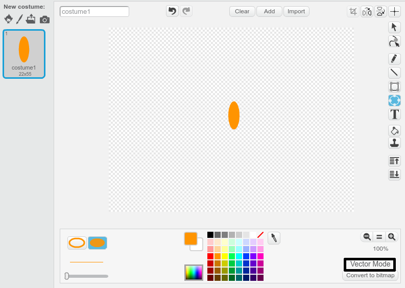
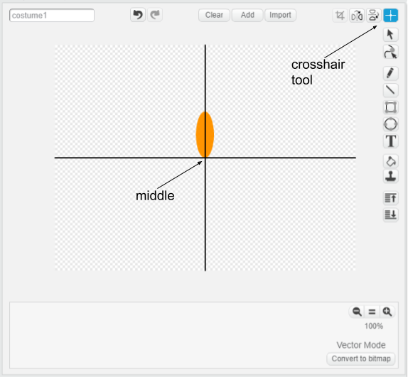

## Generate a flower

First you're going to generate a flower that can be drawn on the Stage. 

--- task ---

Create a new Scratch project, and delete the cat sprite.

[[[generic-scratch-new-project]]]

--- /task ---

--- task ---

Now use the Paint tool to create a new sprite shaped like a flower petal.

Click on **Paint new sprite** and rename it 'Flower'.

[[[generic-scratch-rename-sprite]]]

--- /task ---

--- task ---

In the Paint tool, switch to **Vector** mode by clicking **Convert to Vector**.

Note: Shapes created using Vector mode look neater when you change their size. 

Use the Ellipse tool to draw a petal shape filled in orange. 

 

Later, you will use code to add more colour.

--- /task ---

--- task ---

Add the following code to the Flower sprite to `stamp`{:class="blockpen"} a flower with six equally rotated petals `when the green flag is clicked`{:class="blockcontrol"}. 


```blocks
when green flag clicked
repeat (6) 
  stamp
  turn cw (60) degrees
end
```

--- /task ---

You may find that your petals are arranged in an odd way:


This is because the sprite is being rotated around its centre. 

--- task ---

Use the Crosshair tool to change where the middle of your Flower sprite is:



The crosshair should be at the bottom of the petal shape. 

--- /task ---

Before you run your code again, you should `clear`{:class="blockpen"} the Stage.

--- task ---

Click on the `clear` block in the Pen tab.

```blocks
clear
```

--- /task ---

--- task ---

Run your code again to check that the flower's petals are straight now.


 
--- /task ---
