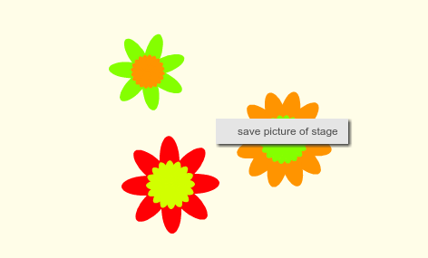

## Save your images

When you create an image you like, you can save it and use it in another Scratch project, as a screensaver, or on a website. 

--- task ---

When there is an image on the Stage that you like, right-click it and then click on **save picture of stage** 

**Note:** on some computers, you need to hold down the <kbd>shift</kbd> key while you right-click. 

  

Then you can save a PNG image of the Stage. 
 
--- /task ---
