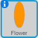

## Random flower generator

You will now use your `draw flower`{:class="blockmoreblocks"} block to create a hundred random flowers all over the Stage whenever you press the <kbd>r</kbd>.


--- task ---

Add a new Event block to your code so that `when the r key is pressed`{:class="blockevents"}, the screen is `cleared`{:class="blockpen"}.



```blocks
when [r v] key pressed
clear
```

--- /task ---

--- task ---

Add in a `repeat`{:class="blockcontrol"} block to go to a `random position`{:class="blockmotion"} `100` times.


```blocks
repeat (100)
  go to [random position v]
end
```

--- /task ---

--- task ---

Use the `draw flower`{:class="blockmoreblocks"} block to create a flower that has a `random`{:class="blockoperators"} colour between `0` and `199`.

You code should now look like this:


```blocks
when [r v] key pressed
clear
repeat (100) 
  go to [random position v]
  draw flower (pick random (0) to (199)) (100) (12) :: custom
end
```

--- /task ---

This code creates one hundred flowers with different colours but with the same size and numbers of petals. 


--- task ---

Can you modify the `when the r key is pressed`{:class="blockevents"} script so the flowers' size and number of petals are also random?

--- hints ---

--- hint ---

The `draw flower`{:class="blockmoreblocks"} block should `pick random`{:class="blockoperators"} numbers for the size and number of petals.

--- /hint ---

--- hint ---

The following blocks pick a random size between `50` and `150` and a random number of petals between `4` and `12`.


```blocks
(pick random (50) to (150))

(pick random (4) to (12))
```

--- /hint ---

--- hint ---

Your code should look like this:


```blocks
when [r v] key pressed
clear
repeat (100) 
  go to [random position v]
  draw flower (pick random (0) to (199)) (pick random (50) to (150)) (pick random (4) to (12)) :: custom
end
```

--- /hint ---

--- /hints ---

--- /task ---

--- task ---

Press <kbd>r</kbd> to see your random flowers.

--- /task ---


