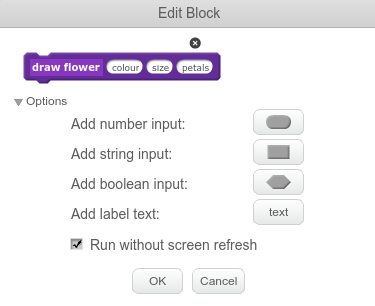
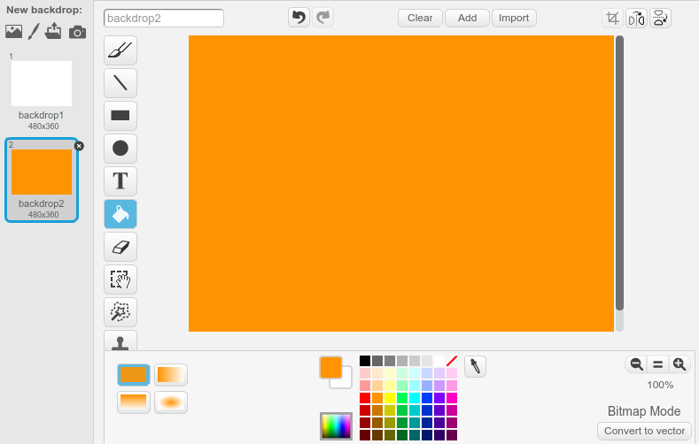

## Flower patterns

You can also use your `draw flower`{:class="blockmoreblocks"} block to create neat flower patterns. 

--- task ---

Create a flower or a combination of flowers that you like. Here's an example:

--- /task ---

--- task ---

Press <kbd>p</kbd> to see your flower. The example looks like this:

  

--- /task ---

Before you can create your pattern, you should clear the Stage of any leftover flowers.

--- task ---

Click on the `clear` block in the Pen tab.

--- /task ---

--- task ---

Right-click on the Flower sprite and `hide`{:class="blocklooks"} it so it doesn't appear on the Stage. (You can `show`{:class="blocklooks"} the sprite again if you need to see where it is.)

--- /task ---

--- task ---

Now draw a row of these flowers across the top of the Stage. Here is some example code, in which you might need to adjust the numbers so it work with your flower:

--- /task ---

--- task ---

Press `p` to see a row of flowers: 

--- /task ---

--- task ---

Add another loop to create more rows of flowers. This example adds a `repeat 3`{:class="blockcontrol"} loop to create three rows. 

 
--- /task ---

--- task ---

Press <kbd>p</kbd> to create a grid of flowers: 

--- /task ---

Do you want to speed up the drawing of the flowers? 

--- task ---
Right-click on the `draw flower`{:class="blockmoreblocks"} definition block and then click on **edit**. Click on the **Run without screen refresh** box. 

Now the flowers get drawn more quickly. 

--- /task ---

You can also change the colour of the Stage.

--- task ---

Click on **Paint new backdrop**. Create an orange backdrop by using the Fill tool in Bitmap mode. 

If you use orange for the backdrop and the Flower sprite, then the numbers for different colours will match for the sprite and the backdrop. 

--- /task ---

--- task ---

Now you can use the `set colour effect`{:class="blocklooks"} on the Stage to change the colour of the backdrop.

--- /task ---

--- task ---

Try to create a pattern you like. 

Here's an example: 
 

 
--- /task ---

When you put it all together, you can create an amazing effect:

